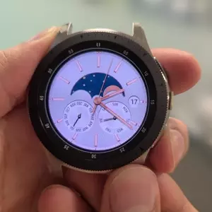

# Tizen Native (Wearable) NNStreamer Application Example - Orientation Detection

## Introduction

This example passes accelerometer sensor data stream to a neural network (tensorflow-lite) via **tensor_src_tizensensor** gstreamer element.
The neural network predicts one of four orientation of the device:

1. 12 o'clock is upward.
2. 3 o'clock is upward.
3. 6 o'clock is upward.
4. 9 o'clock is upward.

## Description

* This is a sample application of Tizen Native for wearable device.
* If you want to run it on your device, Tizen 6.0 or higher is required.
* About details of NNStreamer, please check [this page](https://docs.tizen.org/application/native/guides/machine-learning/machine-learning-inference).
* Used gstreamer pipeline:  
  **`tensor_src_tizensensor (accelerometer) -- tensor_filter -- tensor_sink`**
  * The accelerometer measures the device's accelerometer vector in 3 axes.
  * The `tensor_src_tizensensor` element feeds those three float values into `tensor_filter` element.
  * TF-lite model `orientation_detection.tflite` predicts possibility of each four orientations.
  * `tensor_filter` element (with the TF-lite model) provides the tensor with four float values (the possibilities) into `tensor_sink`

## Screenshot

